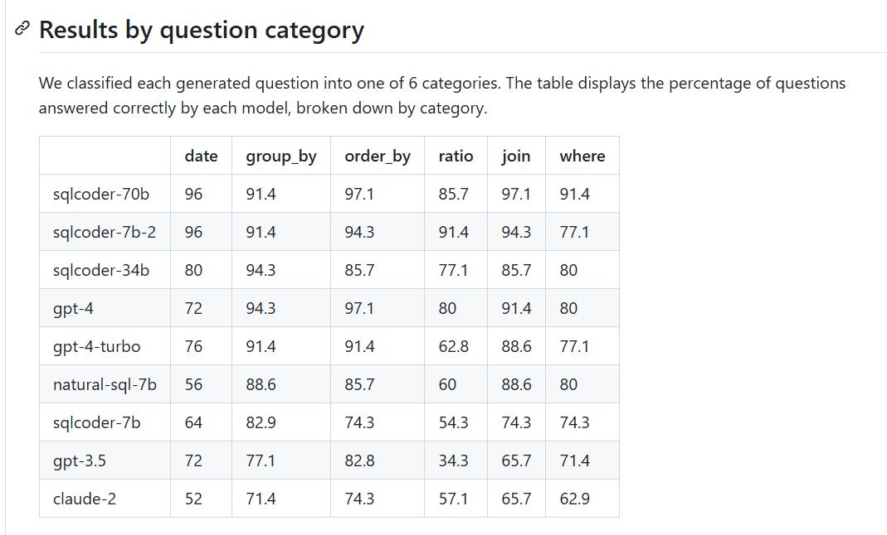

# Slides need to add

1. [X] Table of contents (Agenda)
2. [X] Mention Schema Router Model (DB Copilot) (Optional)
3. [ ] Add Comparison top LLM models specialized for text2sql, more about why choosing OmniSQL
4. [X] Add slide to note down what is key metrics to evaluate text2sql model: EM (Exact Match) & EX (Execution Accuracy) & TS (Test Suite Accuracy) & VES (Valid Efficiency Score)
5. [X] Mention that: because system prompt has some SQL composing rules and the golden datasets has not been reviewed yet, so it lead to hight mis match rate, this results can improve in the future
6. [X] Apply Toonify Token Optimization for system prompt + injected context (schemas): https://github.com/Shubhamsaboo/awesome-llm-apps/tree/main/advanced_llm_apps/llm_optimization_tools/toonify_token_optimization
7. [ ] Add more insight about current error logs
8. [X] Bổ sung benchmark metrics như:
    
9. [X] Live Demo
1. [X] Q&A slide
1. [X] Reference documents
